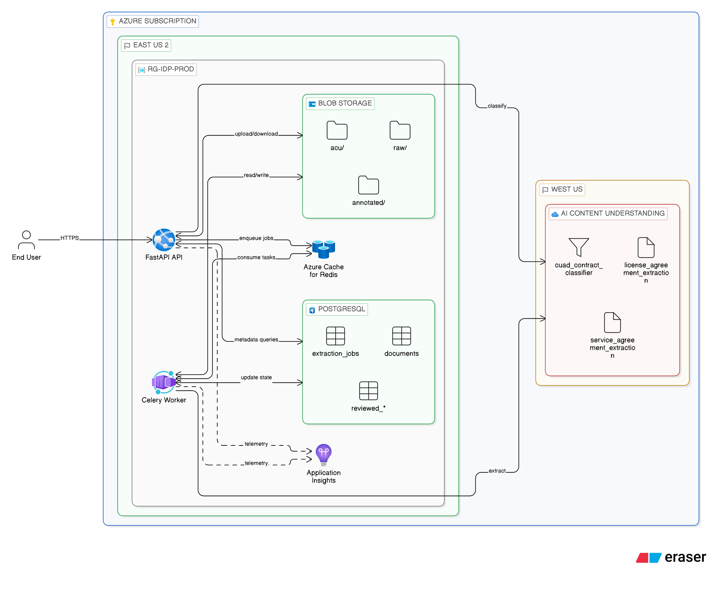
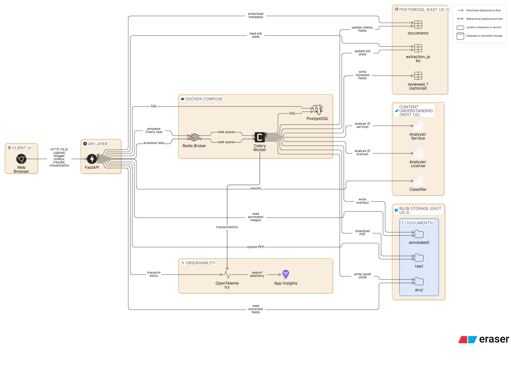
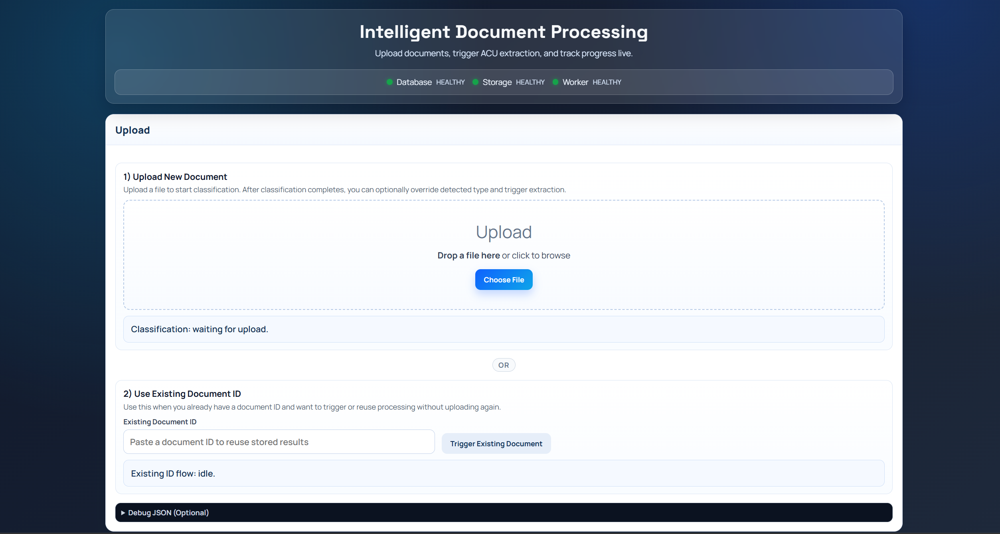
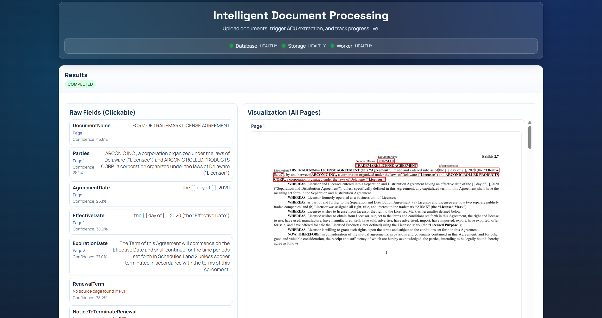
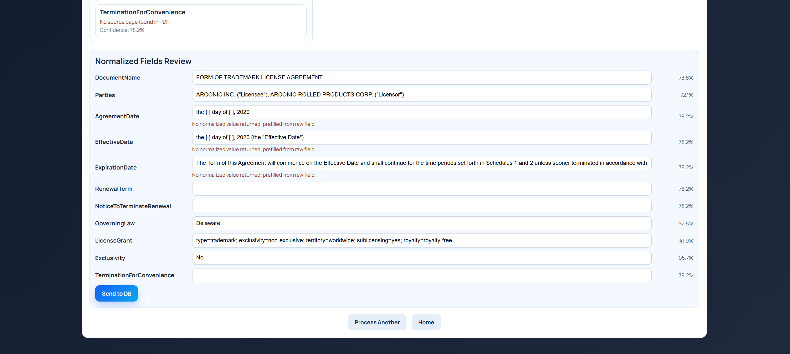
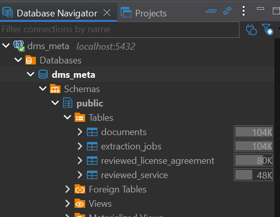
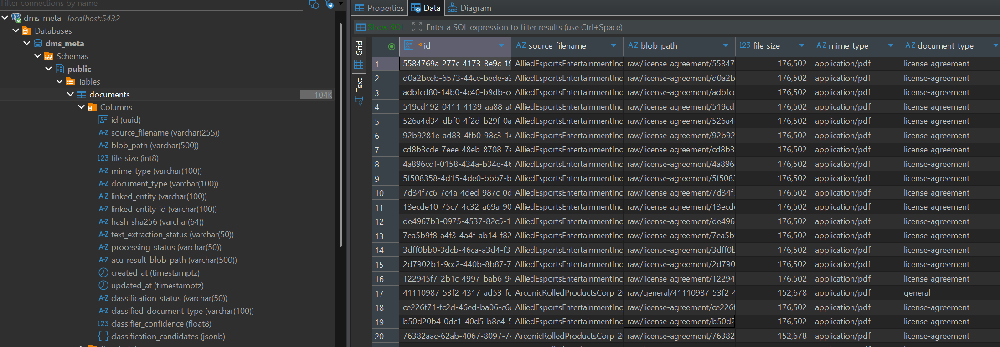
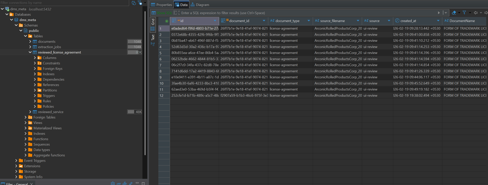
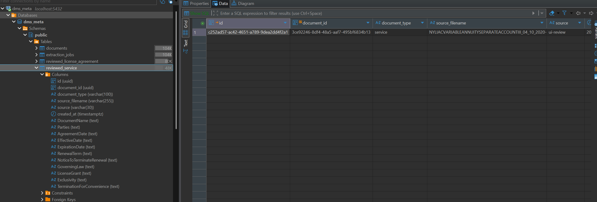
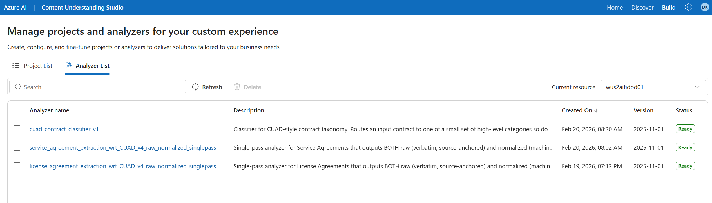

# Intelligent Document Processing (Production Ready)

End-to-end document extraction pipeline using:

- FastAPI (`src/api`) for upload, trigger, status, and results
- Celery + Redis for async orchestration
- PostgreSQL for document/job metadata
- Azure Blob Storage for document and ACU outputs
- Azure Content Understanding (ACU) for structured extraction

Click below to watch the demo ⬇️
[](https://www.youtube.com/watch?v=Bq9vYdkDa7Y)

## Architecture


## Data Flow


## Project Structure

- `src/api`: FastAPI service, routes, response models, UI template
- `src/tasks`: Celery tasks (`process_document_async`, `run_full_pipeline_task`, `process_acu_task`)
- `src/integration`: ACU integration pipeline
- `src/dms`: document management service + storage/metadata adapters
- `src/storage`: blob stage helpers (`raw`, `acu`, `annotated`)
- `compose.yml`: Docker services (`postgres`, `redis`, `celery-worker`)
- `run_api.py`: local API entrypoint
- `start_document_pipeline.py`: optional orchestrator script
- `ops/`: analyzer scripts + database SQL assets for repeatable rollout

## UI Screenshots

#### Home Page


#### Visual UI


#### Norm fields UI


## Data Flow

1. Upload file to `/api/v1/upload`
2. API auto-runs ACU classifier and stores detected `document_type`
3. File stored in `documents/raw/<document_type>/<document_id>.<ext>`
4. User can override detected type, then trigger via `/api/v1/documents/{document_id}/trigger`
5. Celery runs ACU extraction with analyzer mapped to final `document_type`
6. ACU JSON stored in `documents/acu/<document_type>/<document_id>.json`
7. Metadata/status updated in PostgreSQL
8. Results served by `/api/v1/results/{document_id}`

## Structured Data Persistence (Postgres)

This project persists structured data in two layers:

1. Operational metadata tables (always used)
2. Reviewed document-type tables (optional, enabled via `ops/db/reviewed_tables`)

### Operational metadata (always on)

Core tables in `dms_meta` track ingestion and pipeline execution:

- `documents`
  - document identity and file metadata
  - blob pointers (`blob_path`, `acu_result_blob_path`)
  - extraction + processing status fields
  - audit timestamps (`created_at`, `updated_at`)
- `extraction_jobs`
  - async job lifecycle and error state per document
  - creation/completion timestamps

Write path in code:

- Upload/register: `src/dms/service.py`
- DB adapter: `src/dms/adapters.py`
- Async updates: `src/tasks/pipeline_tasks.py`

### Reviewed structured outputs (optional)

For typed business-ready outputs (for example license-agreement normalized fields), apply SQL assets from:

- `ops/db/reviewed_tables/`
- `ops/db/migrations/`

These tables are intended for downstream app/reporting workflows, while full ACU payloads remain in Blob for traceability.

### Blob vs DB responsibility

- Azure Blob stores large artifacts:
  - source files (`documents/raw/...`)
  - full ACU JSON (`documents/acu/...`)
- Postgres stores queryable structured state and relationships:
  - statuses, job progression, document typing, reviewed normalized rows


### Database Tables



#### Documents Table


#### License Agreement Table


#### Service Agreement Table


## Prerequisites

- Python 3.11+ (project venv recommended)
- Docker Desktop (running)
- Azure Blob Storage account and connection string
- Azure Content Understanding endpoint, API key

## Environment

Create/update `.env` at project root with:

```env
AZURE_STORAGE_CONNECTION_STRING=...
AZURE_BLOB_CONTAINER=documents

AZURE_AI_ENDPOINT=...
AZURE_AI_API_KEY=...
AZURE_AI_API_VERSION=2025-11-01
# Required when setting ACU defaults for a fresh Azure account:
ACU_GPT41_MINI_DEPLOYMENT=...

# Observability (OpenTelemetry -> Azure Application Insights)
APPLICATIONINSIGHTS_CONNECTION_STRING=...
OTEL_SERVICE_NAME=intelligent-document-processing-api
OTEL_RESOURCE_ATTRIBUTES=deployment.environment=dev,service.namespace=idp
OTEL_TRACES_SAMPLER=parentbased_traceidratio
OTEL_TRACES_SAMPLER_ARG=1.0

# Docker-side defaults
PGHOST=localhost
PGPORT=5432
PGDATABASE=dms_meta
PGUSER=dms
PGPASSWORD=dms
REDIS_URL=redis://localhost:6379/0
```

Notes:

- Do not commit `.env` or secrets.
- Local host processes (API/notebooks) require:
  - `PGHOST`, `PGPORT`, `PGDATABASE`, `PGUSER`, `PGPASSWORD`, `REDIS_URL`
- Inside Docker, `compose.yml` explicitly overrides service connectivity for worker:
  - `PGHOST=postgres`
  - `REDIS_URL=redis://redis:6379/0`

## Ops Bootstrap (Run Before Starting Project)

Run these once per new Azure account/subscription (or whenever you need to recreate ACU assets).

### 1) Activate venv and run from project root

```bash
# Git Bash
source .venv/Scripts/activate
```

```powershell
# PowerShell
.\.venv\Scripts\Activate.ps1
```

### 2) Create ACU analyzers/classifier

Recommended order:

1. License analyzer (also handles `gpt-4.1-mini` defaults if missing)
2. Service analyzer
3. CUAD classifier

```bash
python -m ops.analyzers.license_agreement.create_license_agreement_analyzer
python -m ops.analyzers.service_agreement.create_service_agreement_analyzer
python -m ops.classifier.create_cuad_classifier
```

If you get `DefaultsNotSet` or model deployment errors, set:

```env
ACU_GPT41_MINI_DEPLOYMENT=<your-azure-openai-deployment-name>
```

then rerun step 2.

### 3) (Optional) Apply DB SQL assets for reviewed output tables

SQL files are in:

- `ops/db/migrations/`
- `ops/db/reviewed_tables/`

Run them in your SQL client (for example DBeaver) against `dms_meta` before using full review/write flows.

## How To Run

### 1) Start infrastructure + worker

```bash
docker compose up -d --build
```

### 2) Activate virtual environment

```bash
# Git Bash
source .venv/Scripts/activate
```

```powershell
# PowerShell
.\.venv\Scripts\Activate.ps1
```

### 3) Start API (local host process)

```bash
export REDIS_URL=redis://localhost:6379/0
python run_api.py
```

### 4) Open endpoints

- UI: `http://127.0.0.1:8000/`
- Health: `http://127.0.0.1:8000/api/v1/health`
- Docs: `http://127.0.0.1:8000/docs`

## Restart (Docker + Host API)

```bash
docker compose down
docker compose up -d --build
```

Then restart host API process:

```bash
python run_api.py
```

## Observability

OTel instrumentation is wired in:

- API startup (`src/api/main.py`)
- Celery worker startup (`src/celery_app.py`)
- Async queue propagation (`src/async_processing.py`)
- Celery task spans (`src/tasks/pipeline_tasks.py`)
- ACU integration spans (`src/integration/pipeline.py`)

### Verify in Azure

1. Open Application Insights -> `Search` (View as `Traces`).
2. Trigger one end-to-end run (upload -> trigger -> status -> results).
3. Confirm trace entries such as:
   - `GET /api/v1/health`
   - `process_document_async`
   - `run_full_pipeline_task`
   - `process_acu_task`
   - `process_document_with_acu`

Sample KQL:

```kusto
requests
| where timestamp > ago(30m)
| project timestamp, name, resultCode, duration, operation_Id, cloud_RoleName
| order by timestamp desc
```

## Analyzer and Table Ops

Use the dedicated `ops/` folder for per-document-type rollout:

- Analyzer scripts:
  - `ops/analyzers/license_agreement/create_license_agreement_analyzer.py`
  - `ops/analyzers/license_agreement/schema.json`
- SQL assets:
  - `ops/db/reviewed_tables/reviewed_license_agreement.sql`
  - `ops/db/migrations/`

Create analyzers/classifier:

```bash
python -m ops.analyzers.license_agreement.create_license_agreement_analyzer
python -m ops.analyzers.service_agreement.create_service_agreement_analyzer
python -m ops.classifier.create_cuad_classifier
```

Analyzers


Apply reviewed table SQL (example):

```sql
-- Run the contents of this file in DBeaver SQL editor:
-- ops/db/reviewed_tables/reviewed_license_agreement.sql
```

### Analyzer Resolution (Current)

ACU analyzer selection is resolved at runtime from a hardcoded map keyed by `document_type` in:

- `src/config/system.py`

Lookup order:

1. `HARDCODED_ACU_ANALYZERS[document_type]`
2. Default hardcoded fallback (`license-agreement`) if needed

Analyzer/classifier IDs are code-owned and do not require `compose.yml` env entries.

## UI Usage

1. Choose file (uploads only)
2. Click `Trigger` (starts processing)
3. Poll `Status` or wait for auto updates
4. View extracted fields in `Results` when completed

## Common Issues

- `Could not trigger processing for document`
  - Document may not be `text_extraction_status=ready`
  - Verify worker + Redis + DB are healthy

- Worker orange in UI but tasks run
  - Usually API process env mismatch or stale API process
  - Ensure API uses `REDIS_URL=redis://localhost:6379/0`

- No traces in Application Insights
  - Ensure `APPLICATIONINSIGHTS_CONNECTION_STRING` is set in environment where API/worker run.
  - Restart both API and worker after env changes.
  - Verify requests appear first (`/api/v1/health`) before checking task spans.

- `ContainerAlreadyExists` log spam
  - Benign; container-existence check is now one-time per process

- Port 8000 in use
  - Find PID: `netstat -ano | findstr :8000`
  - Kill PID: `taskkill /PID <PID> /F`

## Dataset

This project uses the **CUAD** dataset as a reference for contract clause extraction design/evaluation:

- https://www.atticusprojectai.org/cuad

## Cost Analysis

### Cost Analysis - Azure Content Understanding + GPT-4.1 Series

This project uses Azure Content Understanding (ACU) for structured extraction and Azure OpenAI (GPT-4.1 series) for field reasoning.

This section provides a transparent breakdown of expected costs based on real usage trials.

### Real Usage Metrics (From Test Runs)

The following averages were derived from multiple document processing trials:

| Metric | Average Per Page |
| --- | ---: |
| Contextualization Tokens | 1,000 |
| GPT Input Tokens | ~1,405 |
| GPT Output Tokens | ~153 |

These numbers reflect actual extraction workloads for legal-style documents (license/service agreements).

### Pricing Assumptions (Global Deployment)

Azure OpenAI pricing (East US / West US - Global models):

| Model | Input ($ / 1M tokens) | Output ($ / 1M tokens) |
| --- | ---: | ---: |
| GPT-4.1 | $2.00 | $8.00 |
| GPT-4.1-mini | $0.40 | $1.60 |
| GPT-4.1-nano | $0.10 | $0.40 |

Azure Content Understanding pricing:

- Content Extraction: $5 per 1,000 pages
- Contextualization: $1 per 1M tokens
- Embeddings not included (no labeled examples / KB used)

### Cost Per 1,000 Pages (Based on Real Usage)

| Model | Content Extraction | Context | Input Tokens | Output Tokens | Total / 1K Pages |
| --- | ---: | ---: | ---: | ---: | ---: |
| GPT-4.1 | $5.00 | $1.00 | $2.81 | $1.22 | $10.03 |
| GPT-4.1-mini | $5.00 | $1.00 | $0.56 | $0.24 | $6.81 |
| GPT-4.1-nano | $5.00 | $1.00 | $0.14 | $0.06 | $6.20 |

### Cost Per Page

| Model | Cost / Page |
| --- | ---: |
| GPT-4.1 | ~$0.010 |
| GPT-4.1-mini | ~$0.0068 |
| GPT-4.1-nano | ~$0.0062 |

Interpretation:

- Processing costs are well under 1 cent per page for mini/nano
- The dominant cost driver is page processing, not token usage

### Cost Per Document Scenarios

10 pages per document:

| Model | Cost / Document | Cost / 1,000 Documents |
| --- | ---: | ---: |
| GPT-4.1 | $0.10 | $100 |
| GPT-4.1-mini | $0.068 | $68 |
| GPT-4.1-nano | $0.062 | $62 |

20 pages per document:

| Model | Cost / Document | Cost / 1,000 Documents |
| --- | ---: | ---: |
| GPT-4.1 | $0.20 | $200 |
| GPT-4.1-mini | $0.136 | $136 |
| GPT-4.1-nano | $0.124 | $124 |

50 pages per document:

| Model | Cost / Document | Cost / 1,000 Documents |
| --- | ---: | ---: |
| GPT-4.1 | $0.50 | $501 |
| GPT-4.1-mini | $0.34 | $340 |
| GPT-4.1-nano | $0.31 | $310 |

### Production Scale Projection

| Total Pages | GPT-4.1 | GPT-4.1-mini | GPT-4.1-nano |
| --- | ---: | ---: | ---: |
| 10,000 pages | $100 | $68 | $62 |
| 100,000 pages | $1,003 | $681 | $620 |
| 1,000,000 pages | $10,030 | $6,810 | $6,200 |

### Key Insights

- Page processing dominates cost: the $5 / 1,000 pages ACU charge is the primary driver
- LLM cost differences are modest:
- GPT-4.1 -> mini reduces cost by ~32%
- mini -> nano reduces cost by ~9%
- Scaling impact is linear: cost scales directly with total page volume
- Token variance has minimal impact compared to page count

Practical takeaway:

For structured contract extraction workloads, GPT-4.1-mini provides an excellent cost-performance balance.

Optimization efforts should focus on:

- Reducing unnecessary page processing
- Avoiding reprocessing duplicates
- Minimizing contextualization when not needed

### Example Formula

For 1,000 pages:

```
Total Cost =
(Content Extraction)
+ (Contextualization Tokens / 1M x $1)
+ (Input Tokens / 1M x Model Input Price)
+ (Output Tokens / 1M x Model Output Price)
```

### Summary

This Intelligent Document Processing system processes legal contracts at:

- ~$6-$10 per 1,000 pages
- <$0.01 per page
- <$0.15 per 20-page contract

This makes the solution economically viable even at large production scale.

If desired, a cost-estimation utility can be added to automatically compute pricing from the API `usage` block for observability and budget tracking.
